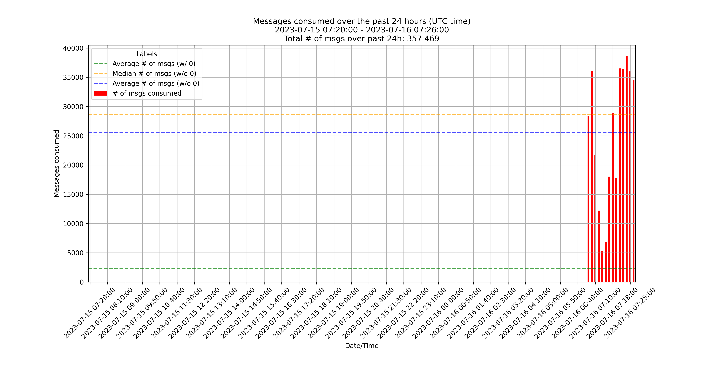

# AIS WS feedhandler

&nbsp;   [](https://github.com/psf/black) 


## Overview

Data provided by the **[AISStream.io](https://aisstream.io/)** API. 
To use it, please sign up using your GitHub account [here](https://aisstream.io/authenticate). 


<p align="center">
    
</p>


### Project's architecture

```
.
├── AIS/
│   ├── Scraper.py
│   ├── Usage.py
│   ├── __init__.py
│   ├── constants.py
│   └── utils.py
├── README.md
├── config.toml
├── examples/
│   └── script.py
├── out/
│   ├── cookies/
│   └── usages/
└── requirements.txt
```

## Getting started

```

```


### ``config.toml`` file structure

```toml
[local]
api.secret_key = "<AISSTREAM API KEY HERE>"
gh.username="<GH_USERNAME HERE>"
gh.password="<GH_PASSWORS HERE>"

[dev]
api.secret_key = ""

[uat]
api.secret_key = ""

[prod]
api.secret_key = ""
```

## License

[MIT](LICENSE)